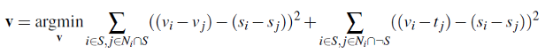
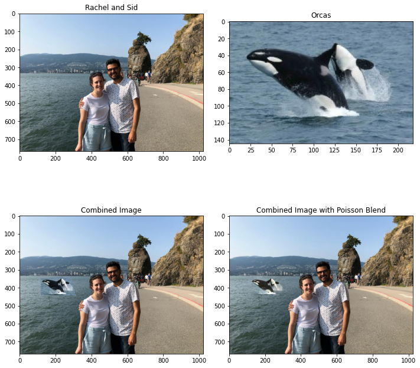
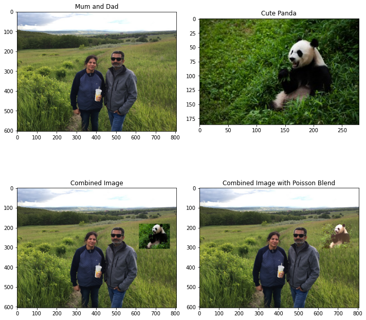

# Image Blending

## Goal 
The primary goal of this project is to seamlessly blend an object or texture from a source image into a target image. The simplest method would be to just copy and paste the pixels from one image directly into the other. Unfortunately, this creates very noticeable seams, even if the backgrounds are well-matched. 

## Gradient Blending
The intended results can be obtained by blending gradients, that is, target pixels that maximally preserve the gradient of the source region without changing any of the background pixels.

We can formulate our objective as a least squares problem. Given the pixel intensities of the source image "s" and of the target image "t", we want to solve for new intensity values "v" within the source region "S":

 
 Here, each "i" is a pixel in the source region "S", and each "j" is a 4-neighbor of "i". Each summation guides the gradient values to match those of the source region. In the first summation, the gradient is over two variable pixels; in the second, one pixel is variable and one is in the fixed target region.
 
 The method presented above is called "Poisson blending". 

 ## Results

Sid and Rach Day out in Stanley Park (Vancouver, Canada)

Mum and Dad on a hike with a cute panda (Calgary, Canada)

 

